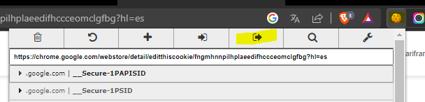

<!-- Improved compatibility of back to top link: See: https://github.com/othneildrew/Best-README-Template/pull/73 -->
<a name="readme-top"></a>
<!--
*** Thanks for checking out the Best-README-Template. If you have a suggestion
*** that would make this better, please fork the repo and create a pull request
*** or simply open an issue with the tag "enhancement".
*** Don't forget to give the project a star!
*** Thanks again! Now go create something AMAZING! :D
-->


<!-- PROJECT SHIELDS -->
[![MIT License][license-shield]][license-url]
[![LinkedIn][linkedin-shield]][linkedin-url]
[![Fiverr][fiverr-shield]][fiverr-url]
[![Gmail][gmail-shield]][gmail-url]


<!-- PROJECT LOGO -->
<br />
<div align="center">
  <a href="https://github.com/darideveloper/europeanstartups_scraper">
    
  </a>

<h3 align="center">Instagram bot 2.0</h3>

  <p align="center">
    Python bot for automate follow, unfollow users and like posts.
    <br />
    <a href="https://github.com/darideveloper/europeanstartups_scraper/issues">Report Bug</a>
    ·
    <a href="https://github.com/darideveloper/europeanstartups_scraper/issues">Request Feature</a>
  </p>
</div>


<!-- TABLE OF CONTENTS -->
<details>
  <summary>Table of Contents</summary>
  <ol>
    <li>
      <a href="#about-the-project">About The Project</a>
      <ul>
        <li><a href="#built-with">Built With</a></li>
      </ul>
    </li>
    <li>
      <a href="#getting-started">Getting Started</a>
      <ul>
        <li><a href="#prerequisites">Prerequisites</a></li>
        <li><a href="#installation">Installation</a></li>
      </ul>
    </li>
    <li><a href="#usage">Usage</a></li>
    <li><a href="#roadmap">Roadmap</a></li>
    <li><a href="#contributing">Contributing</a></li>
    <li><a href="#license">License</a></li>
    <li><a href="#contact">Contact</a></li>
  </ol>
</details>


<!-- ABOUT THE PROJECT -->
# Details

## Workflow

The project need target users (more details in the `settings` section). 

The bot will:
1. Get users from the followers, and last post comments and likes from the target users.
2. Follow each user found.
3. Like last 3 posts from each user found.
4. If the bot already follow the user, it will unfollow all of them.
5. Restart from step 1.

More details in `roadmap` section.

Note: the project don't need user login, but it need the user cookies. The cookies are saved in the `cookies.json` file. The bot will use the cookies to avoid the login in the page.
More details in the `run` section.


# Built With


<div>
<a href="https://www.python.org/">
  
</a>
<a href="https://www.selenium.dev/">
  
</a>


## Install

To get a local copy up and running follow these simple example steps.

## Prerequisites

* [Google chrome](https://www.google.com/intl/es-419/chrome/)
* [Python >=3.10](https://www.python.org/)
* [Git](https://git-scm.com/)
* [Chrome extension: EditThisCookie](https://chrome.google.com/webstore/detail/editthiscookie/fngmhnnpilhplaeedifhccceomclgfbg?hl=es)

## Installation

1. Clone the repo
   ```sh
   git clone https://github.com/darideveloper/europeanstartups_scraper.git
   ```
2. Install python packages (opening a terminal in the project folder)
   ```sh
   python -m pip install -r requirements.txt 
   ```
3. Create a `.env` file in the project folder (more details in the `settings` section)


# Settings

## Cookies file

The bot need the user cookies to avoid the login in the page. The cookies are saved in the `cookies.json` file (create file if not exist).
For save the cookies, do the following steps (with the chrome extension [EditThisCookie](https://chrome.google.com/webstore/detail/editthiscookie/fngmhnnpilhplaeedifhccceomclgfbg?hl=es) already installed):

1. Open chrome as always
2. Open instagram
3. Login in the page (if you are not logged in)
4. Open the extension
5. Click in the button `Export`

6. Open the file `cookies.txt` in the project folder
7. Paste the cookies
8. Save file

## Proxies file

The bot will use proxies to avoid the instagram ban. The proxies are saved in the `proxies.json` (create file if not exist) file. The bot will use a random proxy for each request.

Proxies format:
```json
[
    {
        "user": "username",
        "password": "mypass",
        "host": "123.123.123.123",
        "ip": "1234"
    },
    {
        "user": "username2",
        "password": "mypass",
        "host": "123.123.123.234",
        "ip": "2345"
    }
]
```

## Env file

The `.env` (create file if not exist) file is used to save the settings of the bot. The file must be created in the project folder.

Sample file:
```bash
headless = true
target_users = elonmusk,freddiervega
max_follow = 20
```

### headless

Hide (true) or show (false) the google chrome window.

### target_users

List of users (separated by comma) that the bot will use to get the followers and last post comments and likes.

### max_follow

Total number of max number of users to follow from ALL target

# Run

For run the bot you can use the files `runs/autorun.py` or `runs/autorun.ipynb`

## Multiple bots

For run multiple bots (on windows) fo the following steps:

1. Copy the project folder as many times as bots you want to run
2. Setup in each bot: cookies, proxies and env file
3. Create a file `run.bat` with the following content:
```bat
start cmd /k "python {project-folder-bot-1}\runs\autorun.py"
start cmd /k "python {project-folder-bot-1}\runs\autorun.py"
```

<!-- ROADMAP -->
## Roadmap

- [x] Login with cookies
- [x] Follow users
- [x] Unfollow users
- [X] Run in loop
- [X] Save last state
- [X] Continue from last state
- [X] Like posts
- [X] Use proxies
- [X] Never follow the same user twice
- [ ] Unfollow and follow process separately 

See the [open issues](https://github.com/darideveloper/europeanstartups_scraper/issues) for a full list of proposed features (and known issues).


<!-- CONTRIBUTING -->
## Contributing

Contributions are what make the open source community such an amazing place to learn, inspire, and create. Any contributions you make are **greatly appreciated**.

If you have a suggestion that would make this better, please fork the repo and create a pull request. You can also simply open an issue with the tag "enhancement".
Don't forget to give the project a star! Thanks again!

1. Fork the Project
2. Create your Feature Branch (`git checkout -b feature/AmazingFeature`)
3. Commit your Changes (`git commit -m 'Add some AmazingFeature'`)
4. Push to the Branch (`git push origin feature/AmazingFeature`)
5. Open a Pull Request

<!-- LICENSE -->
## License

Distributed under the MIT License. See `LICENSE` for more information.

<!-- CONTACT -->
## Contact

Darideveloper - [@developerdari](https://twitter.com/developerdari) - darideveloper@gmail.com.com

Project Link: [https://github.com/darideveloper/europeanstartups_scraper](https://github.com/darideveloper/europeanstartups_scraper)


<!-- MARKDOWN LINKS & imgs -->
<!-- https://www.markdownguide.org/basic-syntax/#reference-style-links -->
[contributors-shield]: https://img.shields.io/github/contributors/darideveloper/europeanstartups_scraper.svg?style=for-the-badge
[contributors-url]: https://github.com/darideveloper/europeanstartups_scraper/graphs/contributors
[forks-shield]: https://img.shields.io/github/forks/darideveloper/europeanstartups_scraper.svg?style=for-the-badge
[forks-url]: https://github.com/darideveloper/europeanstartups_scraper/network/members
[stars-shield]: https://img.shields.io/github/stars/darideveloper/europeanstartups_scraper.svg?style=for-the-badge
[stars-url]: https://github.com/darideveloper/europeanstartups_scraper/stargazers
[issues-shield]: https://img.shields.io/github/issues/darideveloper/europeanstartups_scraper.svg?style=for-the-badge
[issues-url]: https://github.com/darideveloper/europeanstartups_scraper/issues
[license-shield]: https://img.shields.io/github/license/darideveloper/europeanstartups_scraper.svg?style=for-the-badge
[license-url]: https://github.com/darideveloper/europeanstartups_scraper/blob/master/LICENSE.txt
[linkedin-shield]: https://img.shields.io/badge/-LinkedIn-black.svg?style=for-the-badge&logo=linkedin&colorB=555
[linkedin-url]: https://www.linkedin.com/in/francisco-dari-hernandez-6456b6181/
[product-screenshot]: ./imgs/screenshot.gif
[gmail-url]: mailto:darideveloper@gmail.com
[fiverr-url]: https://www.fiverr.com/darideveloper
[gmail-shield]: https://img.shields.io/badge/-gmail-black.svg?style=for-the-badge&logo=gmail&colorB=555&logoColor=white
[fiverr-shield]: https://img.shields.io/badge/-fiverr-black.svg?style=for-the-badge&logo=fiverr&colorB=555&logoColor=white

<span>Last code update: <time datetime="2022-11-29" class="last-update">2022-11-29</time>
